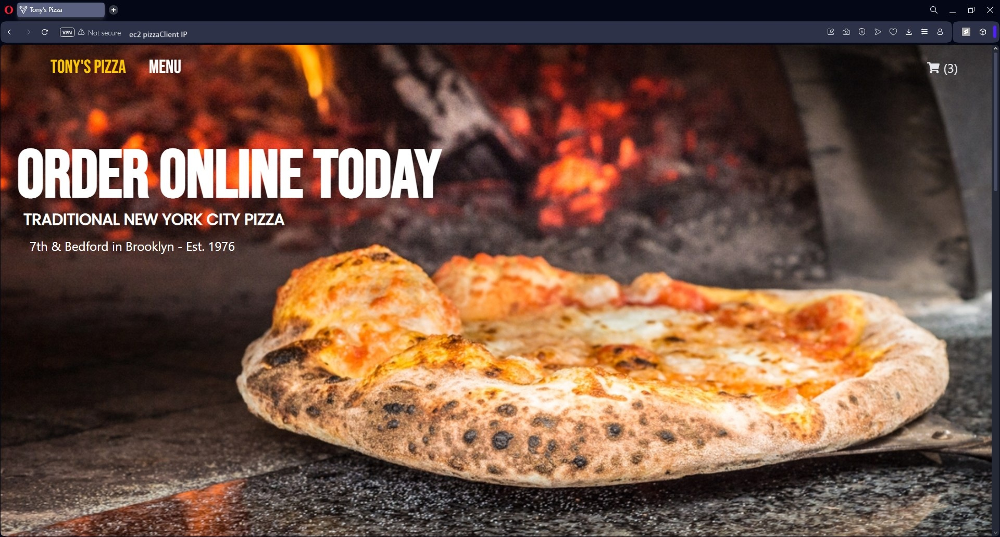
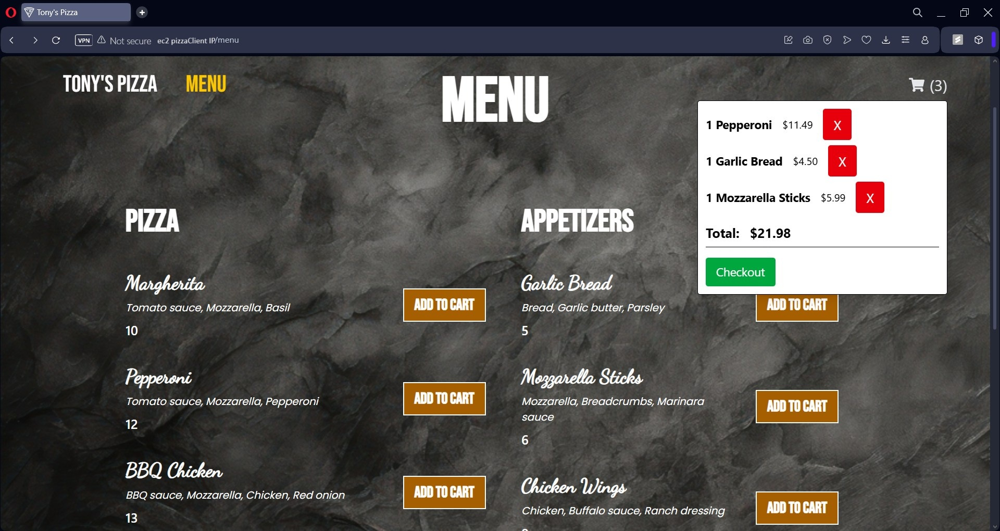
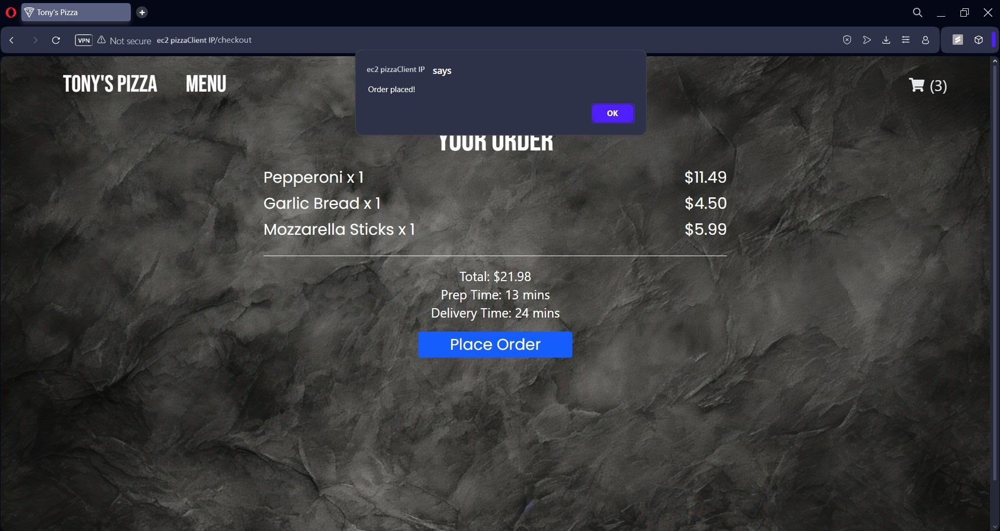
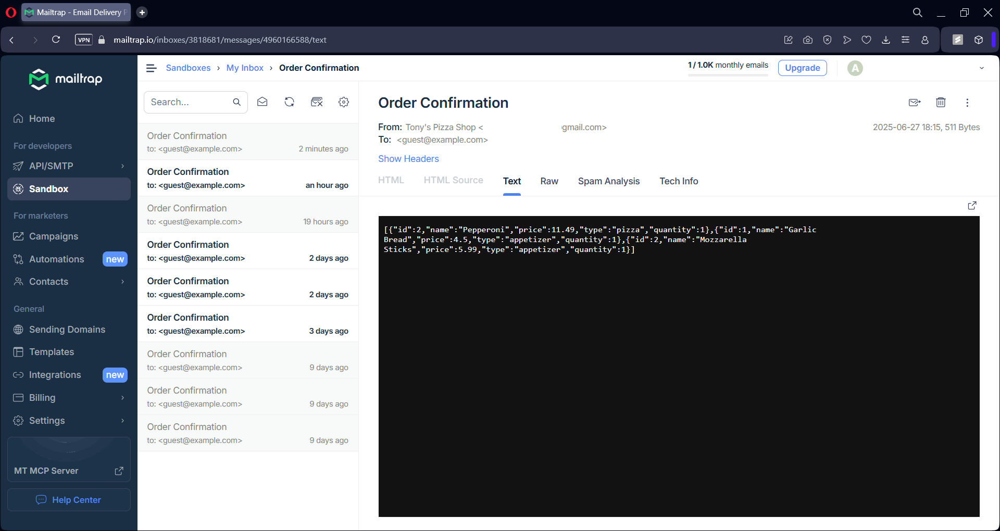
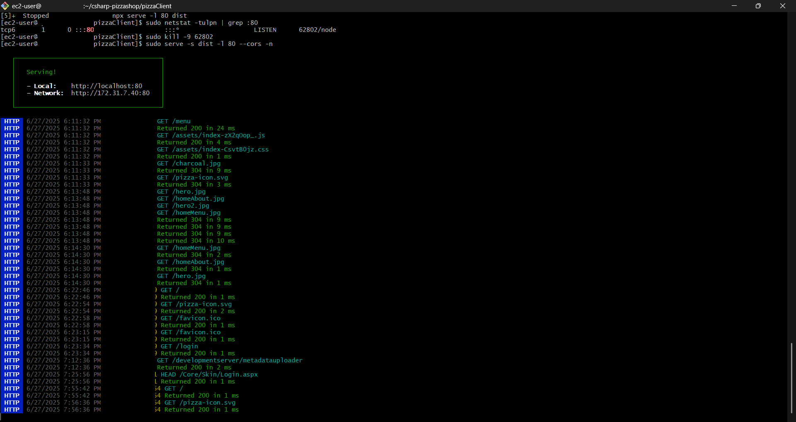
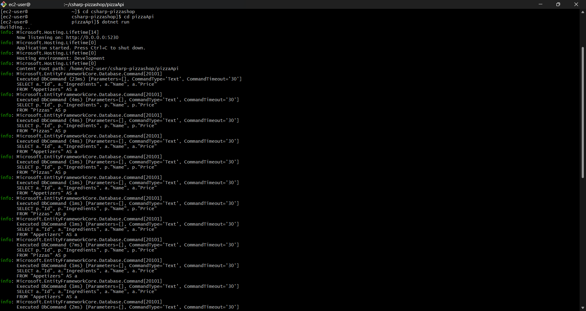
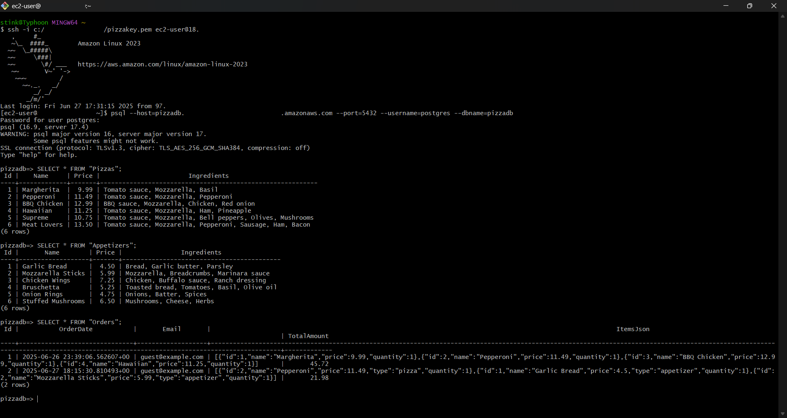
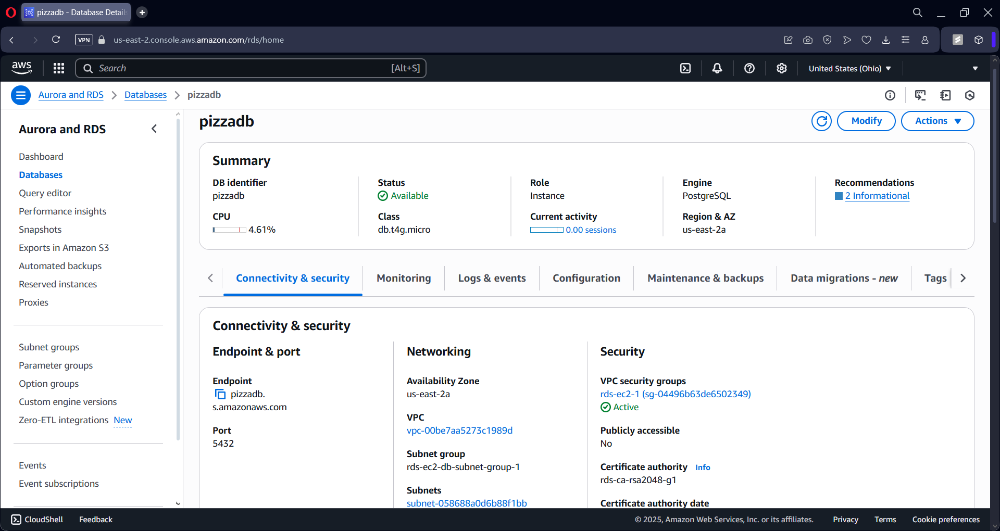

# Pizza Shop (C#/Dotnet, React)
- C#/.Net 8 Rest API
- EF Core
- PostgreSQL
- React
- TypeScript
- Tailwind CSS
- Mailkit & Mailtrap email confirmation
- Context API for cart/checkout
- AWS EC2, RDS deployments

## Home

## Menu

## Checkout

## Mailtrap order confirmation

## EC2 Client

## EC2 Server

## RDS Postgresql DB

## RDS Dashboard in AWS

